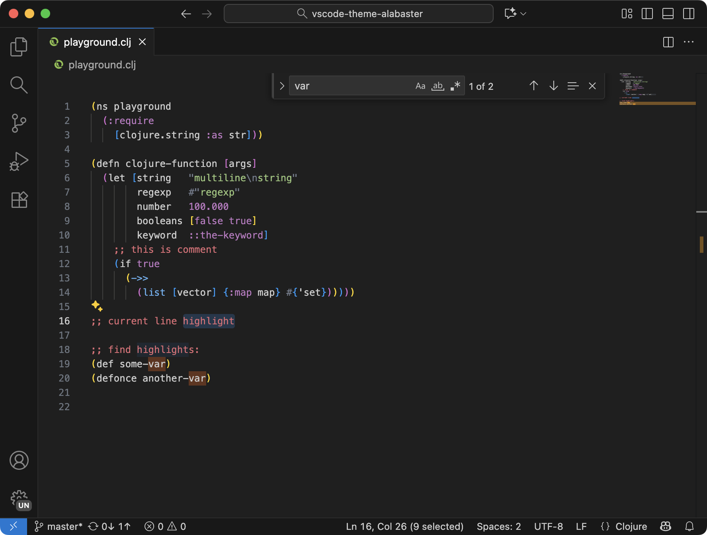

# Alabaster Theme

A dark theme for [Visual Studio Code](http://code.visualstudio.com) with minimal syntax highlighting, based on [Nikita Prokopov’s Alabaster](https://marketplace.visualstudio.com/items?itemName=tonsky.theme-alabaster) and VS Code’s Dark Modern color theme.

## Motivation

I came across [Nikita’s article on syntax highlighting](https://tonsky.me/blog/syntax-highlighting/) and became keen on using Alabaster. The original Alabaster theme for VS Code uses a light UI theme, and while there are variations of it with dark UI colors, I just wanted the Alabaster syntax highlighting with the default VS Code color theme, so I made this fork.

More on Alabaster itself:

> Most color themes highlight everything they can, ending up looking like a fireworks show.
>
> Instead, Alabaster uses minimal highlighting; it defines just four classes:
>
> 1. Strings
> 2. All statically known constants (numbers, symbols, user-defined keywords, boolean values)
> 3. Comments
> 4. Global definitions
>
> Additionally:
>
> - Alabaster does not highlight standard language keywords (if, else, function, etc). They are usually least important and most obvious part of any program.
>
> - Alabaster highlights comments. Most themes try to dim comments by using low-contrast greys. I think if code was complex enough that it deserved an explanation then it’s that explanation we should see and read first. It would be a crime to hide it.
>
> - Alabaster doesn’t use font variations. It’s hard to scan code when it jumps between normal, **bold** and *italics* all the time. Also, not all fonts provide bold/italics variants.
>
> - Having minimal amount of rules means you can consciously use them to look for the exact piece of information you need. Most other “fireworks” themes provide only one meaningful contribution: if it’s colored it’s probably syntactically correct. Instead, in Alabaster you can actually remember all the rules, and e.g. if you need to look for a string you know that you’re looking for a green token. And all the strings really pop out because there are not many other things highlighted.
>
> - Alabaster only highlights things that parser could identify reliably. I believe that if highlighting works only partially then it does more harm than good. When highlighting works reliably, your brain learns to rely on it. When it’s not reliable, your brain spends precious brain cycles to re-check everything it sees on the screen.

## Install

1. Go to `Extensions`
2. Search for `suhailskhan.theme-alabaster-dark-modern`
3. Install

## Credits

- [Nikita Prokopov](https://tonsky.me/) for [Alabaster](https://github.com/tonsky/vscode-theme-alabaster)
- [Alexey Pustoshilov](https://github.com/apust) for [Rubber Theme](https://github.com/apust/vscode-rubber-theme)
- [Contributors to the Visual Studio Code project](https://github.com/microsoft/vscode/graphs/contributors) for [Dark Modern color theme](https://github.com/microsoft/vscode/blob/main/extensions/theme-defaults/themes/dark_modern.json)

## License

[MIT License](LICENSE)
